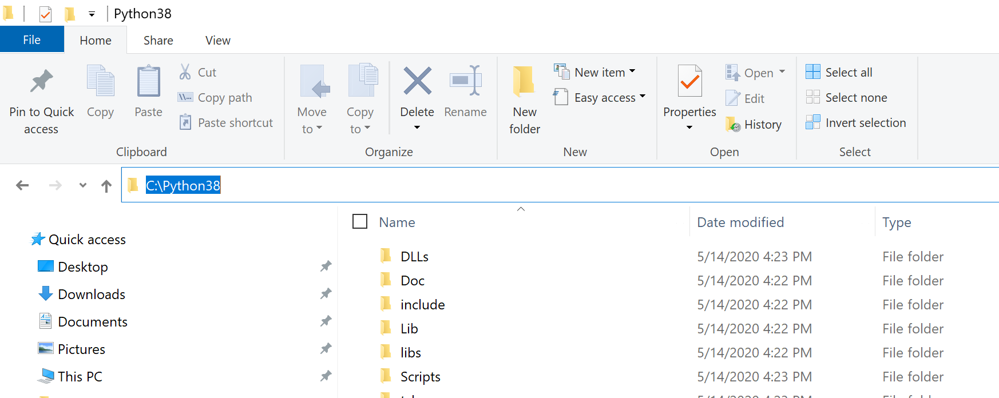
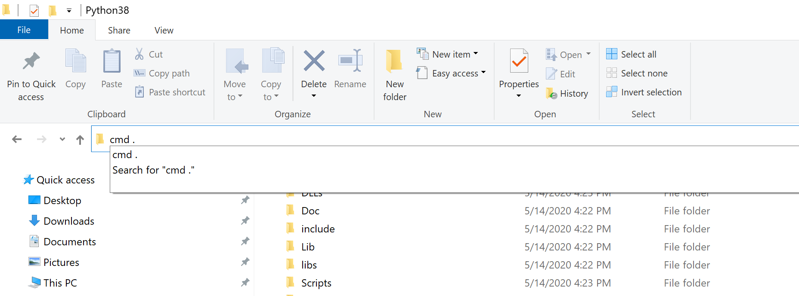
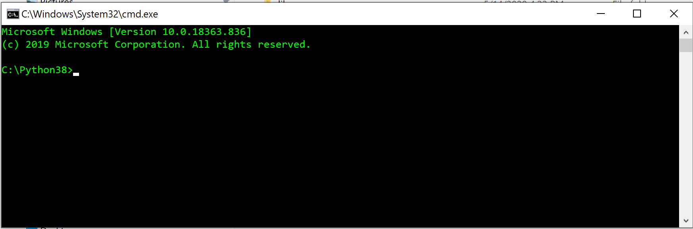
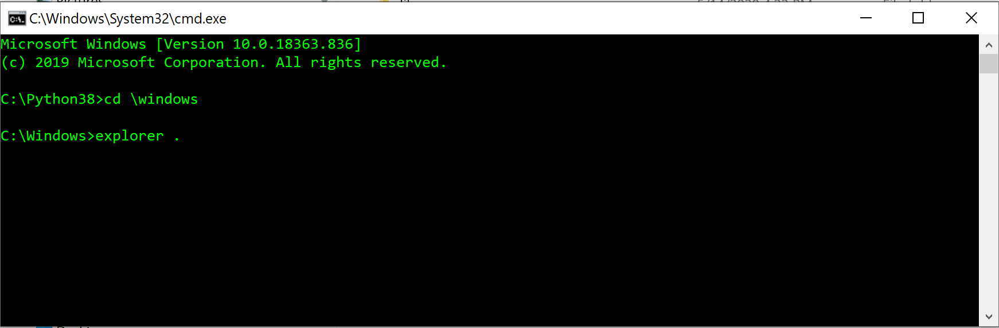
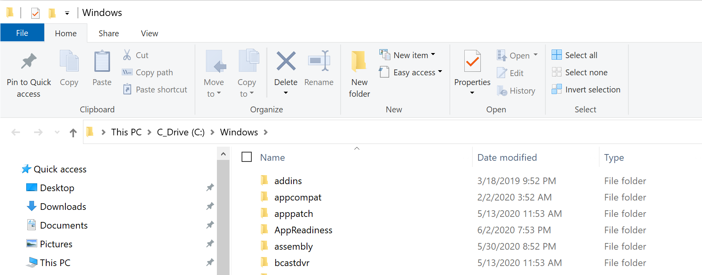
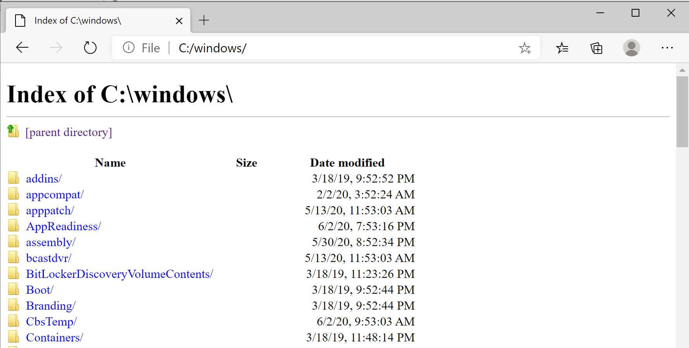
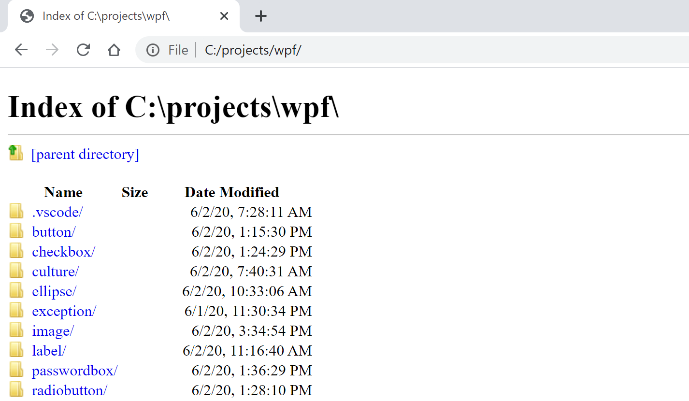
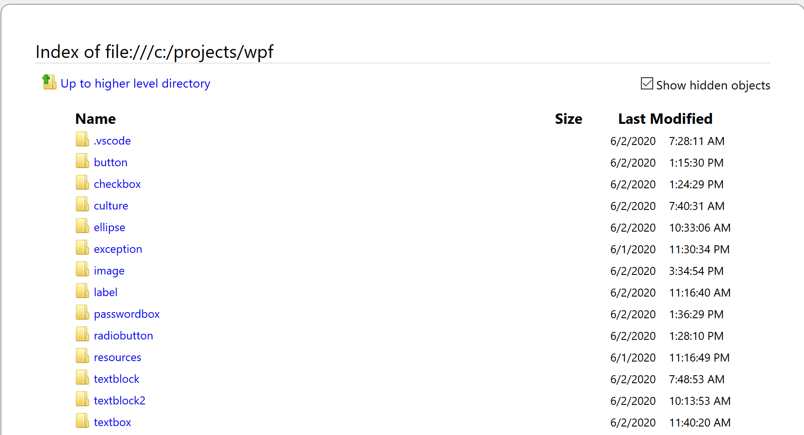
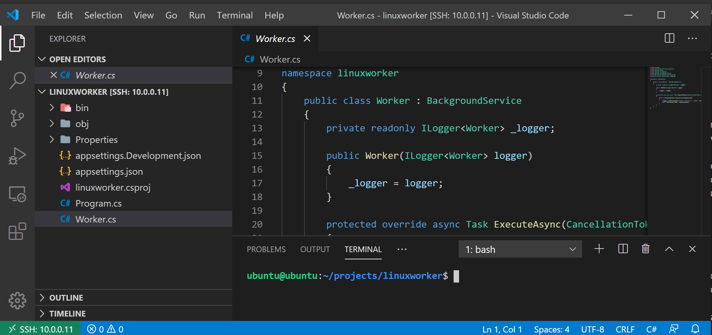

# Tricks to Work with GUI and CLI on Windows 10

When you work on computer a lot, there are always ways to do things better or more efficient, as their creators always add smarts and tricks to improve productivities and work environments waiting for us to discover, or some clever users figure out ways to do things more fun and effectively.

It’s a big shock when people were first given Apple II personal computer with color graphics. We then get used to all GUI computers and devices, including the phones embedded into our daily lives. I work on Windows a lot, from there I can access local machines, remote machines, embedded devices, Internet or what have you.

When we get used to GUI operations, sometimes, it feels a hassle or inconvenience to open up an command line box when needed, or vice versa.

There are actually some tricks to help us out. Here are several of them I found useful and got into habit to use them often:

## 1. File Explorer and Command Line Box

When you are browsing through your file systems with file explorer and have an urge to get back to a commandline to manipulate files or conduct tasks, you can actually select the file path and simply type “cmd” and hit the return key, you’ll be then presented a beautiful “cmd” box under your command.

Even better, you can add a “.” after “cmd” to land a commandline box matching the file directory you are working in the file explorer:

(“ .” means the current directory where you are at)


Fig. 1 File Explorer in C:\Python38 Directory


Fig. 1 Type “cmd .” in File Path and Then Hit “Return” Key


Fig3. A CMD is Popped UP!

On the other hand, if you are in a commandline box and tired of typing, would like to go back to the graphic file explorer, you can just issue:
```
c:\...\explorer  
```
or 
```
c:\...\explorer .     
```

and the file explorer will pop up right in front of your eyes.

Fig4.  Issue “explorer .” at “C:\Windows” Directory


Fig. 5 File Explorer Pops UP in “C:\Windows” Directory

## 2. Your Browser and File Explorer:

From your browser, you can actually browse your files quickly by typing in your browser URL field:

* Windows Edge: type “C:” or the directory you want to to, for instance:

“C:\users”

* Google Chrome: same as the above
* FireFox: type“file://C:” or “file://c:\users”
* In all of above browsers, it doesn’t matter if you type your file path in forward slashes or backslashes or mixed slashes, they all work! I wish that all file systems behave like this.
* Other browsers would probably support this in the similar ways

What’s more and even better is that our browsers right now are so powerful, they can display a lot of files in different formats on the spot. For instance, you can click on any text files in your browser directory to quickly view them, or image files such as .png, .jpg and etc. And they all support viewing pdf files as well!

Some of them even offer you an option to open a file format by its native App or similar App with your permission! (For instance, FireFox) This file browsing and file viewing combination feature on the same browser page has helped me a lot to save time to avoid several extra steps otherwise.


Fig. 6 Windows Edge Browser Display File System


Fig. 7 Google Chrome Browser Display File System


Fig. 8 FireFox Browser Display File System

Give it a try and play with it for a while to see if you like it or not.

## 3. Work With Remote Systems

For more advanced users with coding tendencies, I would recommend VSCode [1], it’s a such a sleek and powerful design with thousands of extension packages you can install and work with. For this GUI/CLI topic, I highly recommend “Remote-SSH” extension package (1.3 M downloads as we speak). You can configure it to work with any machine supporting SSH service, especially with remote or headless Linux boxes. If you prefer GUI editor, this is really paradise where your remote machines are simply attached to your central PC with a super GUI IDE and integrated terminals.


Fig. 9 VSCode works with remote Ubuntu Project

In Fig. 9, VSCode on Windows system opens up by SSH to a remote Ubuntu project, on the left panel, it’s the project folder and files. There are two panels on the right side: the one on the top opens project files for editing and the one on the bottom is a terminal session for your keyboard skills.
What’s else do you want? And no need to cram into Nano to edit your files.

## Reference:

[1] https://code.visualstudio.com/